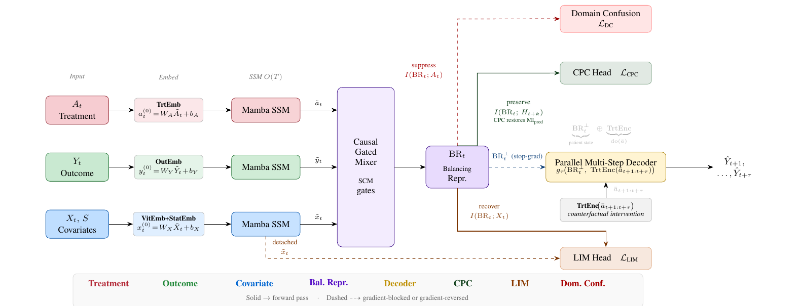
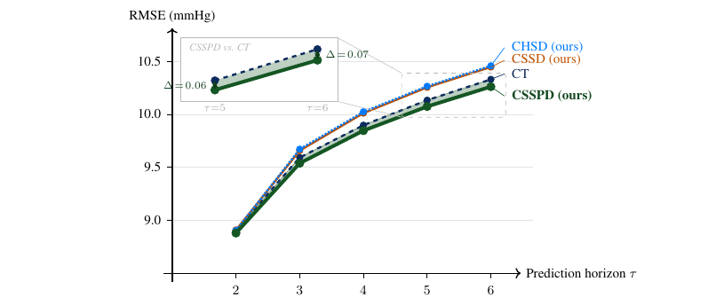

# CausalStateSpaceModel

Official code release for:

> **"Causal State-Space Model for Causal Inference: Estimating Longitudinal
> Individual Treatment Effects"**
>
> Abisoye Abidakun¹, Mingjun Zhong¹, Georgios Leontidis²
>
> ¹ Department of Computing Science, University of Aberdeen, Aberdeen, UK
> ² UiT The Arctic University of Norway
>
> [arXiv:XXXX.XXXXX](https://arxiv.org/abs/XXXX.XXXXX) *(placeholder — update once assigned)*

This repository extends the [CausalTransformer](https://github.com/Valentyn1997/CausalTransformer)
codebase ([Melnychuk, Frauen & Feuerriegel, 2022, ICML](https://proceedings.mlr.press/v162/melnychuk22a/melnychuk22a.pdf))
with a selective-state-space encoder, a non-autoregressive parallel multi-step
decoder, and two contrastive regularisers (CPC, LIM) that resolve a
balancing-prediction mutual-information conflict introduced by domain-confusion
adversarial training. See `REPLICATION.md` for exact commands to reproduce every
reported result, including the baselines.

---

## Architecture

<p align="center">
  
</p>

**CSSPD architecture.** Three streams ($A_t$, $Y_t$, $X_t/S$) are embedded and passed
through $L$ independent Mamba SSM layers ($O(T)$) to produce $\tilde{a}_t,\tilde{y}_t,\tilde{x}_t$.
A SCM-gated `CausalGatedMixer` fuses them into the balancing representation $\mathrm{BR}_t$.
*Domain confusion* (dashed red) suppresses $I(\mathrm{BR}_t;A_t)$ via gradient reversal but
inadvertently suppresses $I(\mathrm{BR}_t;H_{t+k})$ and $I(\mathrm{BR}_t;X_t)$. *CPC* (solid
green) restores temporal MI $I(\mathrm{BR}_t;H_{t+k})$; *LIM* (solid orange) restores
covariate MI $I(\mathrm{BR}_t;X_t)$. The parallel decoder receives two distinct inputs: a
stop-gradient copy $\mathrm{BR}_t^\perp$ (dashed blue) encoding patient state, and
$\mathrm{TrtEnc}(\bar{a}_{t+1:t+\tau})$ (solid black) encoding the counterfactual
intervention; together they produce all $\tau_{\max}$ predictions simultaneously. CSSD
omits the CPC and LIM heads.

---

## Models

### Proposed (this paper)

| Model | Description |
|---|---|
| **CSSD**  | Selective-SSM encoder (`SST`) + parallel multi-step decoder + domain confusion. Base model. |
| **CSSPD** | CSSD + CPC (Contrastive Predictive Coding) + LIM (Local Information Maximisation). **Main proposed model.** |
| **CHSD**  | CSSD with the treatment stream replaced by causal self-attention (`CausallyConstrainedHybridBlock`) — architectural ablation. |
| **CHSPD** | CHSD + CPC + LIM — combined architectural + objective-level ablation. |

Reported results (Cancer Simulation, MIMIC-III, ablations) are quoted directly from
the paper below; see `REPLICATION.md` for the exact commands used to produce them.

### Baselines evaluated in the paper

| Model | Method family | Reference |
|---|---|---|
| **CT**    | Self-attention + domain confusion (primary baseline) | Melnychuk et al. (2022), ICML |
| **CRN**   | GRU + gradient-reversal adversarial balancing | Bica et al. (2020), ICLR |
| **RMSN**  | LSTM + inverse-probability-of-treatment weighting | Lim et al. (2018), NeurIPS |
| **G-Net** | LSTM g-computation | Li et al. (2021), MLHC |

### Other infrastructure present but not part of the paper's reported comparisons

`EDCT` (encoder-decoder attention variant of CT) and `MSM` (linear IPTW marginal
structural model, Robins et al. 2000) are runnable but are not among the four
baselines the paper's Results section reports against.

---

## Results

### Cancer Simulation

Mean normalised RMSE averaged over τ = 1–6 steps and 5 random seeds (lower is
better; **bold** = best per column). ¶ Baseline results are reproduced. ‡ CHSD and
CHSPD exhibit high variance at γ≥2.

| Model | γ=0 | γ=1 | γ=2 | γ=3 | γ=4 | Avg |
|---|---|---|---|---|---|---|
| RMSN (Lim et al. 2018)¶ | 0.758±0.051 | 0.807±0.041 | 0.791±0.111 | 0.954±0.137 | 1.142±0.266 | 0.890 |
| CRN (Bica et al. 2020)¶ | 0.711±0.059 | 0.721±0.037 | 0.781±0.086 | 1.624±0.893 | 1.253±0.250 | 1.018 |
| G-Net (Li et al. 2021)¶ | 1.039±0.087 | 1.024±0.093 | 1.321±0.107 | 1.154±0.183 | 1.293±0.232 | 1.166 |
| CT (Melnychuk et al. 2022a) | 0.720±0.059 | 0.758±0.042 | 0.829±0.060 | 0.961±0.084 | 1.434±0.440 | 0.940 |
| **CSSD (ours)** | **0.422**±0.078 | **0.500**±0.053 | 0.915±0.082 | **0.878**±0.159 | **1.393**±0.554 | 0.821 |
| **CSSPD (ours)** | **0.454**±0.227 | **0.479**±0.181 | **0.572**±0.186 | **0.712**±0.333 | **0.838**±0.269 | **0.611** |
| **CHSD (ours)** | **0.412**±0.052 | **0.477**±0.048 | 0.930±0.334‡ | 0.830±0.127 | 1.503±0.423‡ | 0.830 |
| **CHSPD (ours)** | 0.401±0.068 | 0.465±0.077 | 0.839±0.306 | 0.760±0.169 | 2.204±0.876‡ | 0.934 |

CSSPD reduces average RMSE by 35% over CT on Cancer Simulation.

### MIMIC-III Real

<p align="center">
  
</p>

**Per-step RMSE vs. prediction horizon on MIMIC-III Real (τ=1–6).** Mean over 5
seeds. At τ=1, CT (4.59±0.06) and CSSPD (4.68±0.06) nearly overlap, with CT
marginally lower; both are off the visible scale (plot shows τ≥2). From τ=2 onward
CSSPD (bold green) is the only model that consistently outperforms CT (dashed
navy); the gap grows monotonically from 0.03 at τ=2 to 0.07 at τ=6, consistent with
CPC's compounding benefit. CSSD and CHSD (orange/teal) lack CPC and fall behind CT
at τ≥3.

---

## Requirements

- Python 3.9+
- CPU is sufficient (all reported results are CPU, float64); see `REPLICATION.md` §1
  for the opt-in MPS/float32 path and its caveats.

## Installation

```bash
python3 -m venv venv
source venv/bin/activate
pip install -e .
export PYTHONPATH=.
```

Built on [PyTorch Lightning](https://pytorch-lightning.readthedocs.io/en/latest/),
[Hydra](https://hydra.cc/docs/intro/) for configuration, and
[MLflow](https://mlflow.org/) for experiment tracking.

## MLflow Setup

`config/config.yaml`'s `exp.mlflow_uri` defaults to `file://./mlruns`, which stores
runs locally without a server. To view results in the MLflow UI, run:

```bash
mlflow ui --backend-store-uri ./mlruns
```

Override the URI with `exp.mlflow_uri=<uri>` if you're running a remote tracking server.

---

## Running Experiments

The training script is shared across models and datasets; mandatory arguments are
documented in `config/config.yaml` and the files under `config/`.

```bash
PYTHONPATH=. python3 runnables/train_<training-type>.py \
  +dataset=<dataset> +backbone=<backbone> exp.seed=10 exp.logging=True
```

`<training-type>` is one of `multi` (CSSD, CSSPD, CHSD, CHSPD, CT, MSM),
`enc_dec` (EDCT, CRN — two-phase, add `model.train_decoder=True` for the decoder
phase), `rmsn`, or `gnet`.

### Backbones

```
+backbone=cssd    # CSSD  — runnables/train_multi.py
+backbone=csspd   # CSSPD — runnables/train_multi.py
+backbone=chsd    # CHSD  — runnables/train_multi.py
+backbone=chspd   # CHSPD — runnables/train_multi.py
+backbone=ct      # CT    — runnables/train_multi.py
+backbone=edct    # EDCT  — runnables/train_enc_dec.py
+backbone=crn     # CRN   — runnables/train_enc_dec.py
+backbone=rmsn    # RMSN  — runnables/train_rmsn.py
+backbone=gnet    # G-Net — runnables/train_gnet.py
+backbone=msm     # MSM   — runnables/train_msm.py
```

Each backbone has hyperparameters saved per dataset, accessed via
`+backbone/<backbone>_hparams/cancer_sim_domain_conf=<gamma>` or
`+backbone/<backbone>_hparams/mimic3_real=diastolic_blood_pressure`. Do not
hand-edit these unless you're deliberately deviating from the paper's reported
settings — see `REPLICATION.md` §7 for how they were verified against the actual
logged experiment runs.

For CT/EDCT/CRN, two adversarial balancing objectives are available:
`exp.balancing=domain_confusion` (used throughout this paper) or
`exp.balancing=grad_reverse` (originally CRN's).

### Datasets

```
+dataset=cancer_sim        # Synthetic Tumour Growth Simulator; set gamma via dataset.coeff=<0.0-4.0>
+dataset=mimic3_real       # MIMIC-III Real; requires PhysioNet access, see below
+dataset=mimic3_synthetic  # MIMIC-III semi-synthetic simulator (not used in this paper's reported results)
```

**Getting the MIMIC-III dataset.** `mimic3_real` requires credentialed access to the raw
MIMIC-III tables via [PhysioNet](https://physionet.org/content/mimiciii/1.4/) (free, but
requires completing CITI "Data or Specimens Only Research" training and signing the data
use agreement).

1. Apply for and complete credentialed access: https://physionet.org/content/mimiciii/1.4/
2. Download the raw MIMIC-III tables and run [MIMIC-Extract](https://github.com/MLforHealth/MIMIC_Extract)
   against them to produce `all_hourly_data.h5`.
3. Place `all_hourly_data.h5` in `data/processed/`.
4. Preprocess it into the format this repo expects:
   ```bash
   PYTHONPATH=. python3 src/data/mimic_iii/load_data.py \
     --data_path data/processed/ \
     --output_path data/processed/mimic3_real/
   ```

See `REPLICATION.md` §2 for the full walkthrough, including outcome/treatment
configuration used in the paper's reported results.

### Example — CSSPD on Cancer Simulation, gamma=1, 5 seeds

```bash
PYTHONPATH=. python3 runnables/train_multi.py -m \
  +dataset=cancer_sim +backbone=csspd \
  "+backbone/csspd_hparams/cancer_sim_domain_conf='1'" \
  exp.seed=10,101,1010,10101,101010 exp.logging=True
```

See `REPLICATION.md` for the complete command set covering every proposed model,
every baseline, and both datasets.

---


## Citation

If you use this code, please cite:

```bibtex
@misc{abidakun2026causalssm,
  title  = {Causal State-Space Model for Causal Inference: Estimating Longitudinal Individual Treatment Effects},
  author = {Abidakun, Abisoye and Zhong, Mingjun and Leontidis, Georgios},
  year   = {2026},
  eprint = {XXXX.XXXXX},
  archivePrefix = {arXiv},
  url    = {https://arxiv.org/abs/XXXX.XXXXX}
}
```

*(arXiv ID is a placeholder — update once assigned.)*

## License

[MIT License](LICENSE) (original copyright retained from the upstream
CausalTransformer repository this project extends).

---
